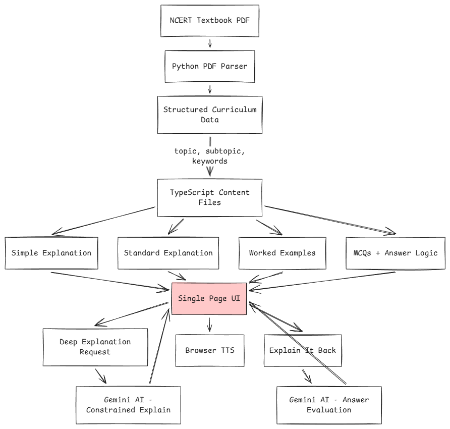

# Project Overview: AI Tutor (NCERT Class 7)

## Why This Project
Class 7 students need fast, clear explanations and immediate feedback while staying strictly within NCERT scope.

## Design Principles
1. One concept at a time to reduce cognitive load.
2. Short, encouraging language for 12-year-old readers.
3. Strict NCERT boundaries to prevent off-syllabus drift.
4. Consistent output structure so the UI stays predictable.
5. Practice immediately after learning to reinforce memory.

## Experience Flow (Learn -> Listen -> Quiz)
The flow is intentionally simple:
1. Learn: a short explanation plus level-based bullets so students can choose depth.
2. Listen: browser TTS for students who learn better by hearing or need accessibility support.
3. Quiz: immediate recall checks to lock in understanding and surface gaps.

This keeps the interaction focused and avoids overwhelming students with long pages.

## How It Works

### 1. Curriculum ingestion
- NCERT textbook PDFs are parsed using Python.
- Content is extracted into topic, subtopic, and keywords.
- Data is stored as structured TypeScript files.

### 2. Deterministic learning layer
The following are hard-coded, not AI-generated:
- Simple explanation
- Standard explanation
- Worked examples
- MCQs with correct answers
- Why wrong options fail

This ensures clarity, stability, and age-appropriate language.

### 3. Targeted AI usage (Gemini)
AI is used only in two places:
- Deep explanation: triggered on demand; uses Gemini to expand intuition and analogies; constrained by topic keywords to avoid syllabus drift.
- Explain-it-back: students explain the concept in their own words; AI evaluates understanding and gives gentle corrective feedback.

## Lab Module (Chemistry Playground)
The project also includes a virtual chemistry lab where students select two chemicals and run a simulated mix.

### How Lab Works
1. Students choose Chemical A and Chemical B from a curated Class 7-safe list.
2. The local reaction engine resolves the outcome deterministically (reaction/no reaction).
3. The UI shows animated reaction cues (colour change, bubbles, precipitate, heat effect) based on reaction metadata.
4. A short explanation is returned for the observed outcome.

### AI Boundary in Lab
- Chemistry facts are always determined by the local reaction dataset and rule engine.
- Gemini is used only to rewrite the deterministic summary into simpler student-friendly wording.
- If AI is unavailable, the app still returns deterministic local output so learning and animations continue.

## Key Decisions and Rationale
- Local curriculum and question bank: ensures accuracy, scope control, and predictable coverage.
- Structured AI response shapes: keeps content consistent and prevents UI breakage.
- Explain-it-back feedback: encourages active recall and helps students self-correct.
- Short, friendly tone rules: reduces anxiety and keeps students engaged.
- Single-page flow: minimizes navigation overhead and keeps attention on the topic.

## What Success Looks Like
Students can understand a topic in minutes, explain it back in their own words, and get gentle, specific feedback. Teachers or parents can trust the content stays within NCERT Class 7.

## Out of Scope (V1)
- Multi-page navigation or accounts
- Progress tracking
- Non-NCERT content
- Malayalam output
- Server-side TTS
- Client-side Mermaid diagram rendering ***(Experimental)**
    (API call -> generate Mermaid text -> client-side rendering)
