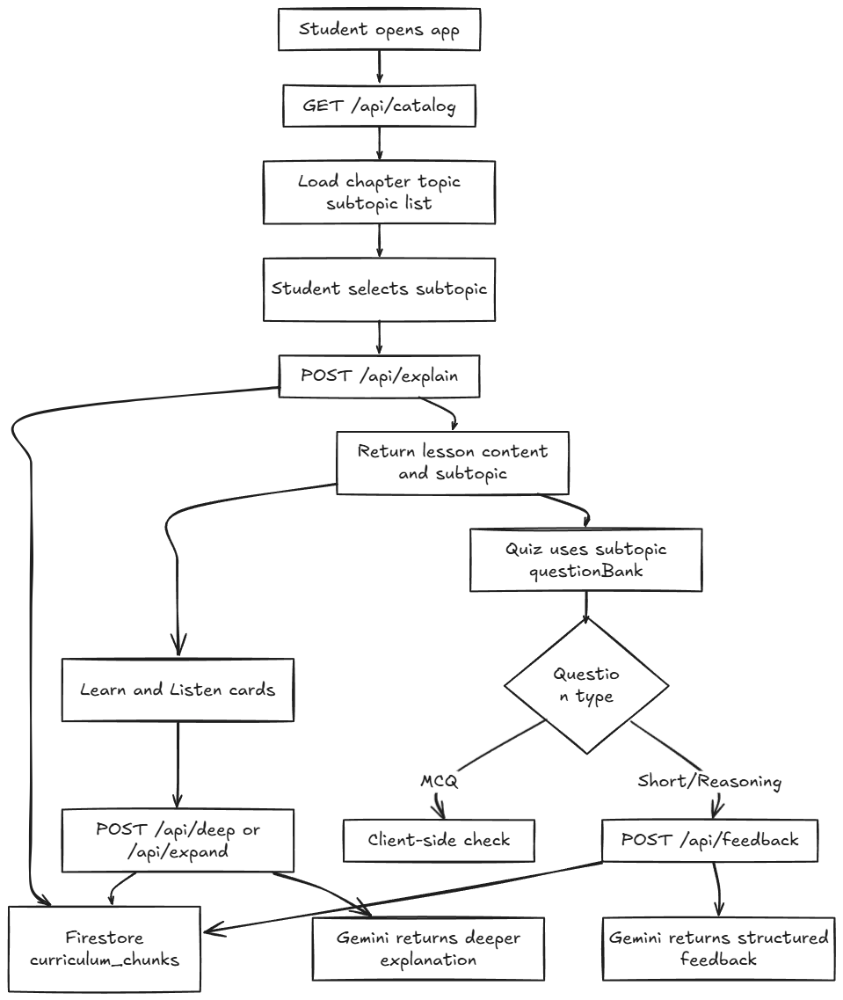

# Project Overview: AI Tutor (NCERT Class 7)

## Why This Project
Class 7 students need clear explanations and quick feedback while staying strictly inside NCERT scope.

## Design Principles
1. One concept at a time to reduce cognitive load.
2. Short, friendly language for 12-year-old learners.
3. Strict NCERT boundaries to avoid off-syllabus drift.
4. Consistent response structure so the UI stays stable.
5. Practice right after learning to improve retention.

## Experience Flow (Learn -> Listen -> Quiz)
The flow is intentionally simple:
1. Learn: short explanation with level-based bullets (simple/standard/deep).
2. Listen: browser text-to-speech for accessibility and audio learning.
3. Quiz: quick recall checks to confirm understanding and reveal gaps.

This keeps the product focused and avoids overwhelming students.

## How It Works

### 1. Curriculum source and delivery
- Firestore (`curriculum_chunks`) is the runtime source of truth.
- The client loads chapter/topic/subtopic catalog from `GET /api/catalog`.
- Lesson requests send `{ subject, chapterId, topicId, subtopicId }` to `POST /api/explain`.
- The response returns:
  - `content` for the Learn card
  - `subtopic` payload (including `questionBank`) for Quiz and context-aware flows

### 2. Deterministic learning layer
The following are deterministic and controlled by project logic (not free-form AI):
- Main lesson structure from `/api/explain`
- Quiz question bank from `subtopic.questionBank`
- Correct answers and explanations shown in Quiz feedback UI

This keeps output stable, age-appropriate, and predictable.

### 3. Targeted AI usage (Gemini)
AI is used in focused places:
- Deep explanation (`POST /api/deep`) for expanded depth.
- Expanded explanation (`POST /api/expand`) for level-based clarity.
- Explain-it-back and short-answer feedback (`POST /api/feedback`) for formative feedback.

All AI routes use the selected subtopic context loaded from Firestore.

## Lab Module (Chemistry Playground + Physics Lab)
The project includes virtual lab experiences with deterministic simulation behavior.

### How Lab Works
1. Students select lab inputs from curated, class-appropriate options.
2. Local simulation engines resolve outcomes deterministically.
3. The UI shows visual effects based on simulation metadata.
4. A short explanation is returned for the observed result.

### AI Boundary in Lab
- Scientific outcomes come from local simulation data and rule engines.
- AI is used only to improve readability where enabled.
- If AI is unavailable, deterministic lab behavior still works.

## Key Decisions and Rationale
- Firestore-backed curriculum: centralized runtime control.
- Deterministic lesson structure: stable output and UI safety.
- Structured AI response shapes: consistent integration and lower break risk.
- Explain-it-back feedback: supports active recall and self-correction.
- Single-page flow: minimal navigation and better focus.

## What Success Looks Like
Students can understand a topic in minutes, explain it back in their own words, and get helpful feedback. Parents and teachers can trust that content stays within NCERT Class 7.

## Out of Scope (Current Scope Guardrails)
- Multi-page navigation or accounts
- Progress tracking
- Non-NCERT content
- Malayalam output
- Server-side TTS
- Ungrounded AI teaching without curriculum context

## Previous Version
For the earlier overview (v0.1.0), see:
- [PROJECT_OVERVIEW v0.1.0](./docs/project-overview/v0.1.0/PROJECT_OVERVIEW.md)
