# AI Tutor — NCERT Class 7 Learning Platform

A full-stack, modular learning platform for NCERT Class 7 (Science & Maths) built as a solo project. It pairs **deterministic curriculum delivery** with **targeted AI assistance** to give students structured lessons, interactive quizzes, two virtual science labs, and AI-powered exploration — all scoped strictly to the NCERT syllabus.

The project spans a **Next.js web application** (React 19, Tailwind, Framer Motion), a **Python PDF-to-curriculum ingestion pipeline**, a **Firebase backend** (Firestore + Auth), and **Google Gemini AI** integration — designed from the ground up with clear module boundaries so each domain (tutor, chemistry lab, physics lab, notes, progress) can evolve independently.

**Live**: Deployed on Vercel · **Stack**: Next.js 16 · React 19 · Firebase · Gemini AI

---

## Table of Contents

1. [Problem & Motivation](#problem--motivation)
2. [Design Philosophy](#design-philosophy)
3. [System Architecture](#system-architecture)
4. [Tech Stack](#tech-stack)
5. [Modularity & Code Organisation](#modularity--code-organisation)
6. [Core Modules](#core-modules)
   - [Learn → Listen → Quiz (Tutor Core)](#learn--listen--quiz-tutor-core)
   - [Chemistry Lab](#chemistry-lab)
   - [Physics Lab (Circuit Builder)](#physics-lab-circuit-builder)
   - [Notes System](#notes-system)
   - [Quick Revision (Flashcards)](#quick-revision-flashcards)
   - [Progress & Profile](#progress--profile)
7. [NCERT PDF Extraction Pipeline](#ncert-pdf-extraction-pipeline)
8. [Data Layer & Schema](#data-layer--schema)
9. [AI Integration & Boundaries](#ai-integration--boundaries)
10. [Authentication & Security](#authentication--security)
11. [Testing Strategy](#testing-strategy)
12. [Key Trade-offs & Decisions](#key-trade-offs--decisions)
13. [Out of Scope](#out-of-scope)
14. [Future Roadmap](#future-roadmap)

---

## Problem & Motivation

Class 7 students studying NCERT Science & Maths face a few recurring challenges:

- **Passive textbooks** — PDFs don't assess understanding or adjust to the learner.
- **Generic AI chatbots** — unconstrained LLMs can hallucinate, go off-syllabus, or pitch content at the wrong level.
- **No safe practice loop** — students read, but rarely get instant feedback on whether they understood.

The goal was to build a platform where the **content is always trustworthy** (sourced from NCERT), the **structure is predictable** (deterministic lessons and quizzes), and **AI is used surgically** — only where it adds genuine value (deeper explanations, formative feedback, natural-language Q&A).

---

## Design Philosophy

These five principles guided every product and engineering decision:

| # | Principle | Why it matters |
|---|-----------|----------------|
| 1 | **One concept at a time** | Reduces cognitive load for 12-year-olds |
| 2 | **Short, friendly language** | Age-appropriate tone builds confidence |
| 3 | **Strict NCERT boundary** | Prevents off-syllabus drift; parents and teachers can trust it |
| 4 | **Deterministic core, AI at the edges** | Lessons and quiz answers are always correct; AI only augments |
| 5 | **Practice right after learning** | Improves retention through immediate recall checks |

---

## System Architecture

### High-Level Overview


### Request Lifecycle

A typical learning request flows through these stages:

1. **Topic selection** — Student picks Subject → Chapter → Topic → Subtopic from the catalog.
2. **Catalog fetch** — `GET /api/catalog` returns the syllabus tree (public, cached).
3. **Lesson load** — `POST /api/explain` fetches the subtopic document from Firestore and returns structured lesson content (deterministic).
4. **AI augmentation** (optional) — Student triggers deep explanation (`/api/deep`), expanded level (`/api/expand`), or submits an explain-it-back answer (`/api/feedback`), each of which calls Gemini with the subtopic context.
5. **Rendering** — Client renders Learn / Listen / Quiz cards. Quiz questions come from the subtopic's pre-generated `questionBank`.

**Why this design?** Keeping the core lesson path deterministic means the UI is always stable, the content is always age-appropriate, and we never show raw LLM output in the primary teaching slot. AI is reserved for moments where students actively seek more depth or need personalised feedback.

---

## Modularity & Code Organisation

The codebase is structured so that each product domain is **self-contained** — with its own components, data-access module, API routes, and tests. This makes it possible to change or extend one domain without touching another.


**Key structural rules:**

- **Domain data access lives in domain modules** — e.g. `lib/chemistry/firestore.ts`, `lib/physics/firestore.ts`. API routes import from their own domain, not across domains.
- **Shared utilities stay shared** — `lib/api/shared.ts` handles common patterns (auth verification, Zod parsing, error responses). `lib/server-cache.ts` provides TTL-bounded caching for any domain.
- **UI components are grouped by domain** — `components/home/`, `components/chem-lab/`, `components/circuit-lab/`, `components/notes/`, etc. Generic UI primitives live in `components/ui/`.
- **Tests mirror the domain structure** — Each domain has dedicated test files (e.g. `chemistry-flow.test.ts`, `circuit-flow.test.ts`, `notes-api.test.ts`).

This modularity was a deliberate investment. Early iterations had lab logic tangled with tutor code; extracting domains made it significantly easier to add the physics lab independently of the chemistry lab, and to test each in isolation.

---

## Tech Stack

| Layer | Technology | Rationale |
|-------|------------|-----------|
| Framework | Next.js 16 (App Router, Turbopack) | Server components + API routes in one project |
| UI | React 19, Tailwind CSS 4, Framer Motion | Modern rendering with smooth animations |
| Database | Firebase Firestore | Document-oriented; fits curriculum chunk schema |
| Auth | Firebase Authentication (Email + Google) | Drop-in auth with ID token verification |
| AI | Google Gemini (`@google/generative-ai`) | Structured output mode, model fallback chain |
| Validation | Zod | Runtime schema validation on every API route |
| Circuit Editor | `@xyflow/react` | Node-based graph editor for circuit building |
| Math Rendering | KaTeX | Fast client-side LaTeX rendering for equations |
| Testing | Jest 30, ts-jest | Unit + integration tests for API and logic |
| PDF Pipeline | Python (PyMuPDF, google-genai) | Offline PDF → curriculum ingestion tool |

---

## Core Modules

### Learn → Listen → Quiz (Tutor Core)

The main learning interface follows a deliberate **Learn → Listen → Quiz** card flow. Each card addresses a different modality: reading, listening, and active recall.


**Thinking behind this flow:**

- **Learn Card** — Renders a deterministic lesson built from Firestore subtopic data (`buildLessonFromSubtopic`). The lesson includes learning objectives, key concepts, key terms with definitions, examples, and misconceptions. Three detail levels (Simple / Standard / Deep) let the student control complexity.
- **Listen Card** — Uses the browser's native `SpeechSynthesis` API. No server cost, no latency, and it works offline. The content read aloud is the same deterministic lesson text.
- **Quiz Card** — Questions come from the subtopic's `questionBank` (3 MCQ, 2 short-answer, 1 reasoning). Correct answers and explanations are pre-authored in the data, not generated on-the-fly. AI is used only to give richer feedback on free-text student answers.

**Key files**: `app/ClientPage.tsx`, `components/home/LearnCard.tsx`, `components/home/QuizCard.tsx`, `components/home/ListenCard.tsx`

---

### Chemistry Lab

A virtual chemistry playground where students select chemicals and observe reactions — all resolved locally without an AI call.


**Design rationale:**

- **Deterministic simulation** — Reaction outcomes are looked up from a curated reaction database (`lib/reactions.ts`), not generated by AI. This guarantees scientific accuracy.
- **AI as optional narrator** — If enabled, AI explains *why* the reaction happened. If AI is unavailable, the lab still works.
- **Two modes** — Free-mix (student picks any chemicals) and guided experiments (curated experiment list from Firestore).

**Key files**: `lib/reaction-engine.ts`, `lib/reactions.ts`, `components/chem-lab/LabBench.tsx`, `components/lab/ReactionResult.tsx`

---

### Physics Lab (Circuit Builder)

A drag-and-drop circuit builder with real-time validation using a graph-based engine.

```mermaid
flowchart TB
    Components["Palette: Battery, Bulbs,<br/>LEDs, Switches, Wires"] --> Canvas["Drag onto Canvas"]
    Canvas --> Graph["Build Terminal Graph<br/>circuit-engine.ts"]
    Graph --> DFS["DFS Traversal"]
    DFS --> Closed{"Closed Circuit?"}
    Closed -->|Yes| Check{"Bulbs in Path?"}
    Closed -->|No| Open["Open Circuit<br/>Nothing lights"]
    Check -->|Yes| Lit["Bulbs Light Up 💡"]
    Check -->|No| Dim["Circuit OK, no load"]
```



**How the circuit engine works:**

The engine (`lib/circuit-engine.ts`, ~300 lines) models each component as a pair of terminals. It builds an adjacency graph from wire connections, then runs DFS from the battery's positive terminal. If a path back to the negative terminal exists, the circuit is closed and any bulbs/LEDs in the path are marked as lit.

- Short-circuit detection flags direct battery connections with no load.
- Component definitions (`lib/circuit-components.ts`) describe terminal positions and visual properties.
- Built with `@xyflow/react` for the node canvas, with custom node types for each component.

**Key files**: `lib/circuit-engine.ts`, `lib/circuit-components.ts`, `components/circuit-lab/CircuitCanvas.tsx`

---

### Notes System

Per-topic note-taking with full CRUD, scoped to the authenticated user.

| Endpoint | Method | Purpose |
|----------|--------|---------|
| `/api/notes` | GET | List or filter notes by subject/chapter/topic |
| `/api/notes` | PUT | Upsert a note |
| `/api/notes` | DELETE | Delete a note |

Notes are stored in Firestore under `student_notes/{uid}_notes` and are accessible via a quick-access panel during learning or a dedicated notes management page. All inputs are Zod-validated; users can only access their own notes.

**Key files**: `app/notes/page.tsx`, `components/notes/TopicNotesPanel.tsx`, `app/api/notes/route.ts`

---

### Quick Revision (Flashcards)

Flashcard-based review built from topics the student has already studied. Each card surfaces key terms and concepts extracted from the curriculum. Self-assessment buttons (Got it / Review again) track review state for future sessions.

**Key files**: `app/quick-revision/page.tsx`, `app/api/quick-revision/flashcards/route.ts`

---

### Progress & Profile

- **Profile** — Display name management via Firebase Auth.
- **Progress** — Learning streaks, topics covered, subject-wise breakdown. Progress data lives in `progress/{uid}` in Firestore.

**Key files**: `app/profile/page.tsx`, `app/progress/page.tsx`, `lib/progress/firestore.ts`

---

## NCERT PDF Extraction Pipeline

Manually authoring curriculum content per-subtopic is slow and error-prone. This offline Python pipeline automates the conversion of **NCERT PDF chapters** into structured, app-ready Firestore documents.

### Pipeline Architecture


### Step-by-Step Breakdown

| Step | File | What it does | Why |
|------|------|--------------|-----|
| **1. Extract** | `extractor.py` | Reads each page with PyMuPDF; extracts text blocks with position, font size, and column ordering; normalises control characters and removes header/footer noise. | Raw PDF text has no semantic structure. Position + font metadata lets us infer hierarchy. |
| **2. Detect** | `detector.py` | Finds chapter → topic → subtopic boundaries using numeric heading patterns (`6.1`, `6.4.2`), font-size heuristics, and table/header-noise suppression. Fallback logic handles partial structures. | NCERT PDFs aren't consistently formatted. Heuristic detection is more robust than regex-only matching. |
| **3. Process** | `processor.py` | Two-phase Gemini calls per subtopic. *Phase 1*: extract learning objectives, key concepts, key terms, examples, misconceptions. *Phase 2*: generate 6 questions (3 MCQ, 2 short, 1 reasoning). Includes retry with backoff and model fallback chain. | Splitting into two phases keeps each prompt focused and the output schema small, improving reliability. |
| **4. Validate** | `validator.py` | Checks required fields, minimum counts, and question format rules before any data is written. | Catches malformed LLM output before it reaches the database. |
| **5. Save / Write** | `main.py` + `firestore.py` | Dry-run mode saves incremental JSON after each subtopic (resumable, supports single-subtopic retry). Write mode reads the reviewed JSON and pushes to `curriculum_chunks`. | Separating dry-run from write allows human review before data goes live; resume support reduces wasted API cost. |

### Operational Commands

```powershell
# Fresh extraction (dry-run)
python scripts/ncert-seeder/main.py --class 7 --subject Science --chapter 6 --pdf gecu106.pdf --fresh

# Resume interrupted dry-run
python scripts/ncert-seeder/main.py --class 7 --subject Science --chapter 6 --pdf gecu106.pdf

# Retry a single subtopic
python scripts/ncert-seeder/main.py --class 7 --subject Science --chapter 6 --pdf gecu106.pdf --retry-subtopic 6.4.5

# Write reviewed JSON to Firestore
python scripts/ncert-seeder/main.py --class 7 --subject Science --chapter 6 --write
```

### Design Decisions in the Pipeline

- **Two-phase LLM processing** — A single mega-prompt for both content extraction and question generation produced inconsistent results. Splitting into Phase 1 (content) and Phase 2 (questions) with separate JSON schemas dramatically improved output quality.
- **Model fallback chain** — If the primary Gemini model returns a 404/unavailable error, the pipeline automatically tries the next model in the chain. This keeps batch runs from failing overnight.
- **Incremental JSON saves** — After each subtopic is processed, the chapter JSON is saved to disk. If the process crashes or a subtopic fails, progress is preserved and only the failing subtopic needs retry.
- **Human review before write** — `--write` mode is deliberately separate from processing. The human reviews and optionally edits the JSON before it goes to production Firestore.

---

## Data Layer & Schema

### Firestore Collections

| Collection | Purpose | Access |
|------------|---------|--------|
| `curriculum_chunks` | Subtopic content (lessons + questions). Keyed by `subject__chapterId__topicId__subtopicId`. | Public read (non-sensitive syllabus data) |
| `students/{uid}` | User profiles | Auth-scoped |
| `progress/{uid}` | Per-user learning progress | Auth-scoped |
| `student_notes/{uid}_notes` | User-specific notes | Auth-scoped |
| `chemistry_reactions` | Reaction database for chemistry lab | Public read |
| `physics_chapter_labs` | Physics lab experiment definitions | Public read |

### Curriculum Chunk Schema

```typescript
interface SubtopicKnowledge {
  id: string;
  title: string;
  learningObjectives: string[];
  keyConcepts: string[];
  keyTerms: Record<string, string>;   // term → definition
  examples: string[];
  misconceptions?: string[];
  deepDives?: string[];
  questionBank: QuestionItem[];        // 3 MCQ + 2 short + 1 reasoning
  visualCards?: VisualCard[];
}
```

This schema is the contract between the PDF extraction pipeline (producer) and the web application (consumer). Both sides validate against it.

---

## AI Integration & Boundaries

### Where AI is Used

| Feature | Route | What AI Does | What Stays Deterministic |
|---------|-------|--------------|--------------------------|
| Deep Explanation | `POST /api/deep` | Expands a subtopic into long-form detail | Lesson structure, source data |
| Level Expansion | `POST /api/expand` | Adjusts complexity (Simple → Deep) | Base content from Firestore |
| Explain-it-back | `POST /api/feedback` | Evaluates student's rephrasing | Correct answer, marking rubric |
| Quiz Feedback | `POST /api/feedback` | Explains why an answer is right/wrong | Correct answer, question text |
| Lab Explanations | Chemistry / Physics routes | Narrates reaction/circuit outcomes | Simulation results from local engine |

### Streaming Support

AI-powered routes support NDJSON streaming for responsive UX:

```
Client sends:  x-ai-stream: 1  +  Accept: application/x-ndjson
Server sends:  {"type":"chunk","delta":"..."}  (incremental)
               {"type":"done", ...finalPayload}  (terminal)
```

If streaming is not requested, routes return standard JSON.

### The AI Boundary Line


**Why this split?** The deterministic side guarantees that core educational content is always correct, age-appropriate, and instantly available. The AI side enhances the experience for students who actively seek more — but if Gemini goes down, the platform still teaches.

---

## Authentication & Security

### Auth Flow

- **Firebase Authentication** with Email/Password and Google Sign-in (popup flow).
- Protected API routes verify the `Authorization: Bearer <idToken>` header using Firebase Admin SDK server-side.
- The home screen and catalog are public. Auth gates only interactive features (AI calls, notes, labs, quizzes).
- Login nudge UI appears when a guest tries a gated action — no hard-block on page load.

### Security Hardening

| Measure | Implementation |
|---------|---------------|
| **Content Security Policy** | Strict CSP in `next.config.ts` with explicit allowlists for Firebase, Google Auth, and Firestore endpoints |
| **Input Validation** | Zod schemas on every API route; max-length limits on all string inputs; enum validation for subjects |
| **User Scoping** | Firestore security rules + server-side UID checks ensure users access only their data |
| **Security Headers** | `X-Content-Type-Options: nosniff`, `X-Frame-Options: DENY`, `Referrer-Policy: strict-origin-when-cross-origin`, restrictive `Permissions-Policy` |
| **Rate Limiting** | Server-side rate limiting on write operations |
| **Error Handling** | Production errors return minimal detail; no sensitive data in logs |

---

## Testing Strategy

### Approach

- **Framework**: Jest 30 with ts-jest for TypeScript support.
- **Pattern**: Mock external dependencies (Firestore, Gemini), test business logic directly.
- **Coverage**: 20 test suites across API routes, client logic, simulation engines, and auth flows.

### Test Suite Overview

| Area | Tests | What's Covered |
|------|-------|----------------|
| API Routes | `api.test.ts`, `catalog.test.ts`, `deep.test.ts`, `expand.test.ts`, `feedback.test.ts` | Request validation, response shape, error handling |
| Notes | `notes-api.test.ts`, `notes-client-api.test.ts` | CRUD operations, client-side API wrapper |
| Labs | `chemistry-flow.test.ts`, `chemistry-facts.test.ts`, `lab.test.ts`, `circuit-flow.test.ts` | Reaction matching, circuit validation, experiment catalog |
| Physics | `physics-lab-chapters.test.ts`, `physics-chapter-lab.test.ts` | Lab chapter loading, experiment data |
| Auth | `auth-ui.test.ts`, `auth-guards.test.ts`, `auth-guards-more.test.ts`, `auth-pages-render.test.ts` | Guard logic, UI rendering, route protection |
| Other | `quick-revision-flashcards.test.ts`, `unittest-questions.test.ts`, `shared-api.test.ts` | Flashcard generation, shared utilities |

```bash
npm test              # Run all 20 test suites
npm test -- notes     # Run notes-related tests
```

---

## Key Trade-offs & Decisions

| Decision | Alternative Considered | Why This Choice |
|----------|----------------------|-----------------|
| **Deterministic lessons from Firestore** (not real-time AI) | Generate every lesson via Gemini on-demand | Guarantees correctness, no hallucination risk, instant load. AI augments only when student asks for more. |
| **Two-phase PDF pipeline** (extract content, then questions separately) | Single mega-prompt | Smaller, focused schemas produce more reliable structured output from the LLM. |
| **Browser TTS** (not server-side speech) | Cloud TTS (Google/AWS) | Zero cost, zero latency, works offline. Acceptable quality for English. |
| **Graph-based circuit engine** (DFS traversal) | Physics simulation library | NCERT Class 7 circuits need on/off validation, not voltage/current simulation. A lightweight graph approach is simpler and accurate for the scope. |
| **Reaction database lookup** (not AI-generated reactions) | Ask Gemini what happens when X meets Y | Scientific accuracy is non-negotiable for a children's platform. A curated database guarantees correct outcomes. |
| **Public catalog, gated actions** (not full auth wall) | Require login to see anything | Reduces friction for new visitors. Only gating AI and write operations keeps the experience welcoming. |
| **Server-side cache with TTL** (not Redis) | Redis/Memcached | Early-stage project. Native in-memory cache with bounded TTL avoids operational complexity while cutting Firestore reads. |
| **Zod on every route** (not ad-hoc validation) | Manual `if` checks | Consistent runtime validation, auto-generated types, clear error messages. |

---

## Out of Scope

The following are deliberately excluded from the current version:

- **RAG / Explore** — The `/api/rag/*` routes and Explore page exist in the codebase but are **disabled**. All runtime teaching stays grounded in `curriculum_chunks` context. *(Future scope.)*
- Multi-page navigation or complex routing
- Teacher/admin authentication or dashboards
- Non-NCERT content
- Malayalam or multi-language output
- Server-side TTS
- Ungrounded AI teaching without curriculum context

---

## Future Roadmap

| Horizon | Planned |
|---------|---------|
| **Near-term** | More quiz question types · Expanded physics lab components · Spaced repetition algorithm for flashcards · Progress analytics dashboard |
| **Medium-term** | Maths topic expansion · Voice input for explain-it-back · Parent/teacher dashboards · Offline support (service workers) |
| **Long-term** | Multi-language support · Adaptive learning paths · Collaborative features · Mobile native apps |

---

*Built with Next.js, Firebase, and Gemini AI*